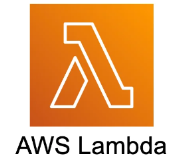
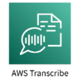
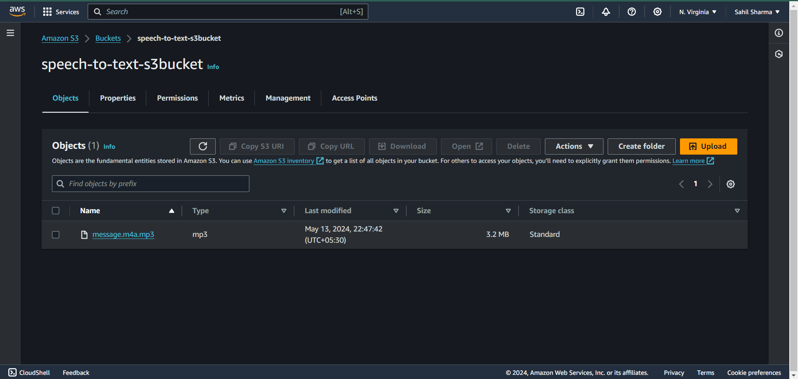
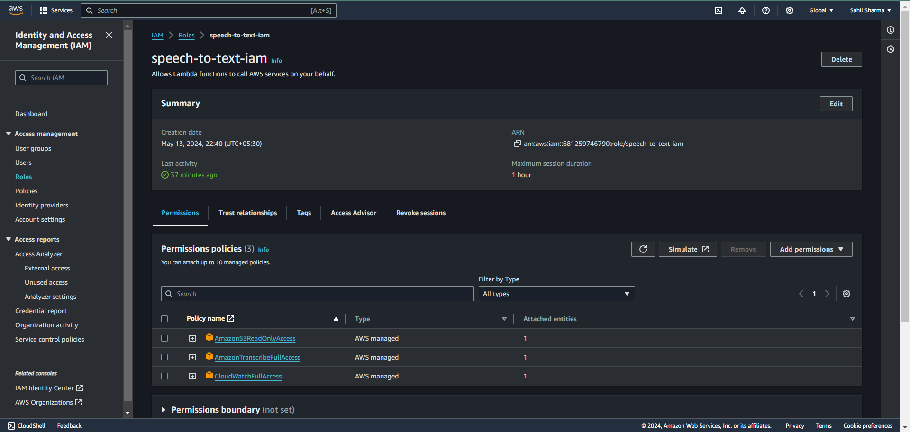
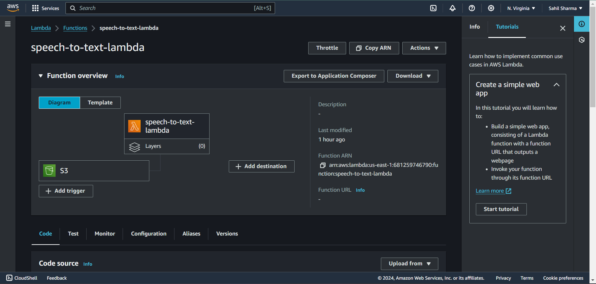
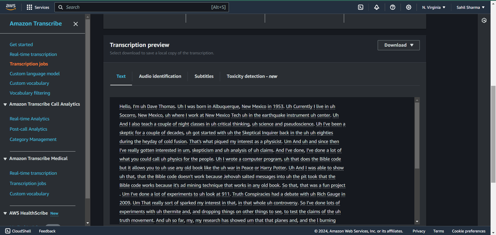

# VoiceScript: AWS-Speech-to-Text-Conversion-Service

VoiceScript is a robust and automated solution for transcribing audio and video files using Amazon Web Services (AWS). This project harnesses the power of AWS Lambda, Amazon S3, and Amazon Transcribe to deliver efficient and reliable transcription services, complete with comprehensive logging and monitoring through Amazon CloudWatch.

## Key Features

<strong>Seamless Media Upload: </strong>Users can effortlessly upload audio or video files to an Amazon S3 bucket, initiating the transcription process.

<strong> Automated Processing: </strong>The upload of a media file automatically triggers an AWS Lambda function, streamlining the transcription workflow.

<strong>Advanced Transcription: </strong>Once triggered, the Lambda function engages Amazon Transcribe to convert spoken content within the media file into accurate text.

<strong>Comprehensive Log Management: </strong>Upon completion of the transcription process, Lambda sends detailed logs to Amazon CloudWatch, facilitating thorough monitoring and debugging.

<strong>State Monitoring & Management: </strong>The change in transcription job state triggers an additional Lambda function, ensuring that all post-transcription processes are executed smoothly and efficiently.

<strong>Secure Output Storage: </strong> The resulting transcription text is securely stored in an Amazon S3 bucket, ready for easy access and further processing.

## Project Tech-Stack

&nbsp;&nbsp;&nbsp;&nbsp;
&nbsp;&nbsp;&nbsp;&nbsp;
&nbsp;&nbsp;&nbsp;&nbsp;

<strong>AWS CloudWatch</strong> monitors AWS resources and applications by collecting metrics, logs, and events. It provides insights into system performance and allows you to set alarms and view data to ensure smooth operation.

<strong>Amazon S3</strong> is a scalable, secure cloud storage service for storing and retrieving any amount of data. It’s perfect for managing files like documents, images, and videos, and integrates with other AWS services for easy data handling.

<strong>AWS Lambda</strong> is a serverless computing service that runs code without needing to manage servers. It automates tasks, scales automatically, and charges only for the compute time used, making it a cost-effective solution for backend operations.

<strong>AWS Transcribe</strong> converts spoken language into written text using advanced machine learning. It supports multiple languages and handles various audio qualities, making it ideal for transcribing audio and video content.

## Results

<strong>* The audio/video file is uploaded in the S3 bucket</strong>

<strong>* AWS IAM: The role is executed here with 3 policies namely
AccessS3ReadOnlyAccess
AmazonTranscribeFullAccess
CloudWatchFullAccess</strong>

<strong>* The purpose of Lambda function is to initiate a transcription job using the Amazon Transcribe service when an audio or video file is uploaded to an S3 bucket.</strong>

<strong>* AWS Transcribe: Within the Transcription section of the project, the resulting text extracted from the audio/video file residing in the S3 bucket is displayed under the Transcription Preview section</strong>
